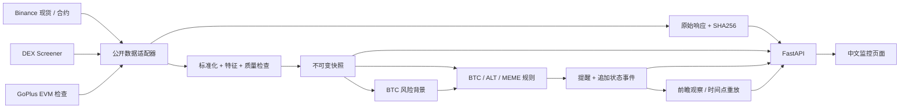

> 当前范围更新：BTC + 默认 99 个 USDT 现货，全部报价每轮更新，详细数据轮换采集；DEX Meme / GoPlus 停止新采集、分析与提醒，仅保留历史。下文 DEX 实现描述为历史版本说明。

# 架构与时间点约束

## 时间字段

- `raw.received_at`：原始响应被本机获取的 UTC 时间。
- `snapshot.market_time`：交易所 ticker 的时间；DEX 缺少报价时间时，使用本机接收该公开报价的时间，并标记 `QUOTE_TIME_UNVERIFIED`。
- `snapshot.available_at`：该快照所有依赖响应都已收到的时间。
- `snapshot.decision_at`：本轮采集结束、所有快照形成后运行联动规则的时间。
- `signal.emitted_at`：判断真正发生的时间。

已收盘 K 线必须在收到该 K 线响应时就已经收盘。不能因为另一个请求晚完成，把先前请求中的未收盘 K 线升级成完整收盘数据。数据库拒绝缺失原始依据、未来依据以及早于数据可用时间的决策。

重放先按 `decision_at` 恢复同一轮的全部数据，再判断 BTC 与各资产；未记录决策时间的测试/旧快照以 `available_at` 为边界。不会读取未来 BTC 快照。

## 持久化

原始响应、快照、提醒、提醒状态事件和验证结果分表存储。快照和提醒追加写入；数据源当前状态允许更新。SQLite WAL 支持网页读与单采集器写入。每个数据库操作使用独立连接，事务退出时关闭连接。

原始数据不会自动裁剪。生产规模扩展需要迁移到 PostgreSQL/对象存储，明确采样频率、压缩、备份、存储预算和保留周期。

## 运行

后台采集器与 API 在同一进程运行，单轮有异步锁，手动触发不会并发启动第二轮。HTTP 并发最多四个；418/429 触发按源退避。循环在当前轮结束后等待配置间隔，因此实际周期包含网络耗时。

读取仪表盘时重新计算新鲜度；即使数据库还有旧行情，旧数据也不会显示为可用。服务健康与行情准备状态是两个不同检查。

## 监控范围

BTC 风险背景目前只来自 Binance BTC；宏观风险和资金轮动显式标记未接入/未知。已采集但质量不完整的特征不自动填零。

DEX 以链、代币地址、池地址共同确定身份，不能将同名代币或不同池子的历史混在一起。公开安全检查结果只代表已覆盖项目，没有安全保证含义。

## 后续扩展接口

`Providers` 是当前组合适配器入口，`Snapshot` 是标准化边界。新 provider 应先落原始数据，再产出带时间、来源和质量状态的快照。规则不得直接发起网络请求。研究报告需要另外保存发布时间、指标时间、首次可用时间和修订版本，不能冒充实时指标。
